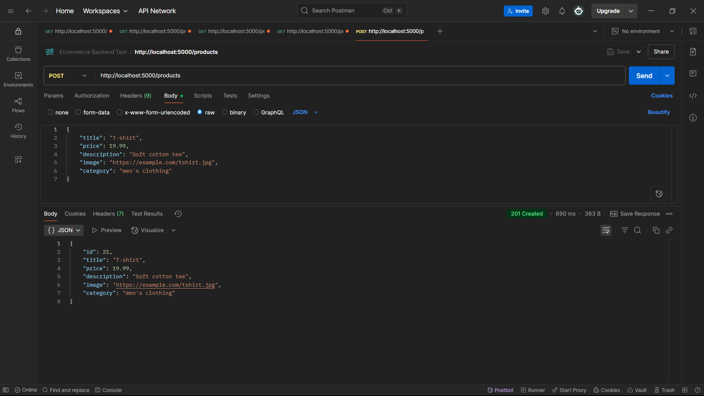
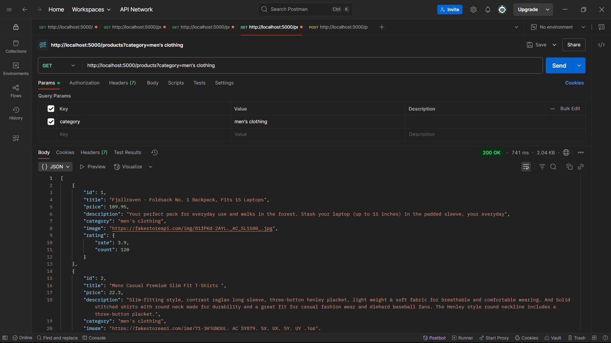
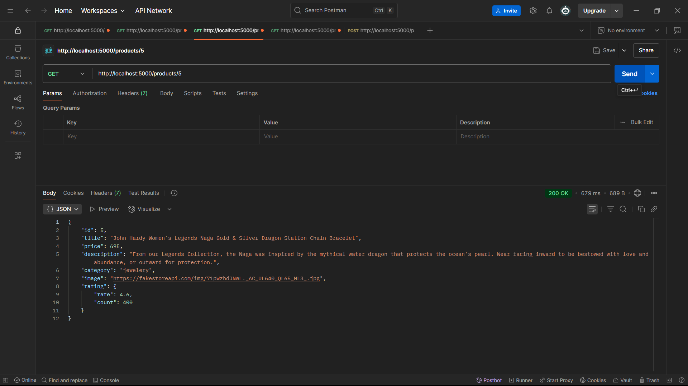
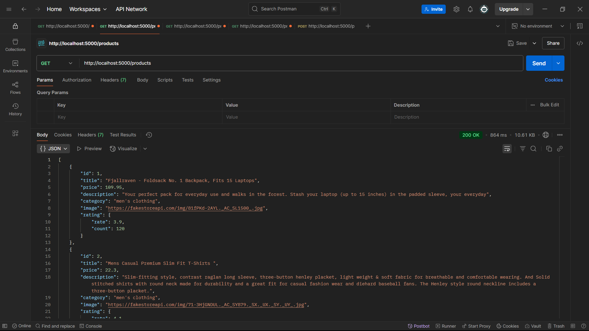
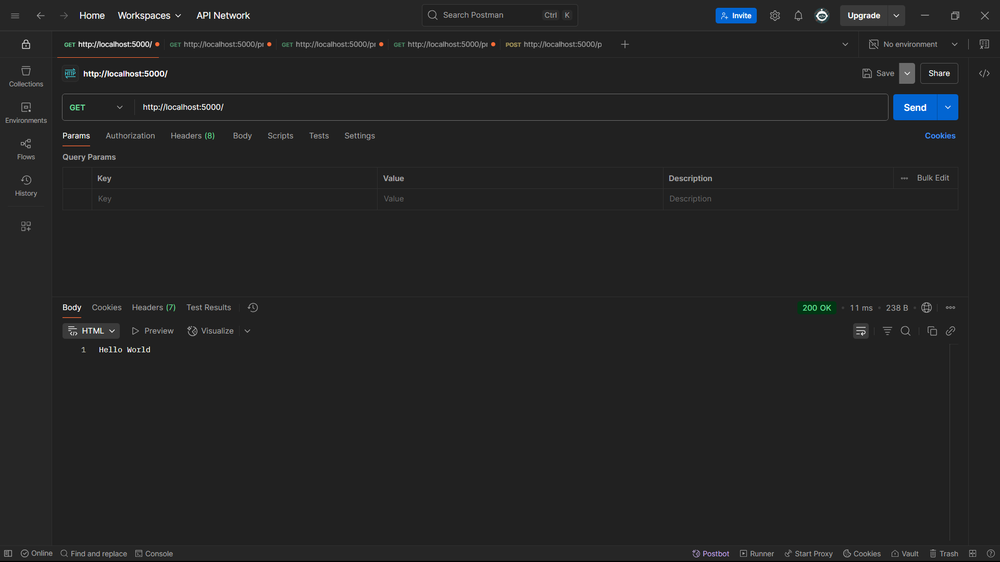

# Product API (E-commerce)

A simple RESTful API for products using Node.js, Express, and fakestoreapi.com as the data source.

## Tech Stack
- Node.js
- Express
- Axios (for HTTP requests)

## How to Run
```bash
npm install
npm start
```
Server runs on port 3000 by default.

## Configuration

You can configure the server port and fakestore API URL using a `.env` file in the project root:

```
PORT=3000
FAKESTORE_API=https://fakestoreapi.com/products
```

If not set, defaults will be used.

## API Endpoints

### 1. Get all products
```
GET /products
```
**Sample:**
```bash
curl http://localhost:3000/products
```

### 2. Get product by ID
```
GET /products/:id
```
**Sample:**
```bash
curl http://localhost:3000/products/1
```

### 3. Filter products by category
```
GET /products?category=Apparel
```
**Sample:**
```bash
curl "http://localhost:3000/products?category=men's clothing"
```

### 4. Add a new product (Bonus)
```
POST /products
Content-Type: application/json
Body: { "title": "T-shirt", "price": 19.99, "description": "Soft cotton tee", "image": "url", "category": "men's clothing" }
```
**Sample:**
```bash
curl -X POST http://localhost:3000/products \
  -H "Content-Type: application/json" \
  -d '{"title":"T-shirt","price":19.99,"description":"Soft cotton tee","image":"https://example.com/tshirt.jpg","category":"men's clothing"}'
```

## Notes
- Uses [fakestoreapi.com](https://fakestoreapi.com/) for product data.
- POST endpoint is for demonstration and will not persist data on fakestoreapi. 

## Postman Screenshots

Below are screenshots demonstrating the API endpoints in action using Postman:

### 1. Get All Products
Shows a successful response for `GET /products`.



### 2. Get Product by ID
Demonstrates fetching a single product with `GET /products/1`.



### 3. Filter Products by Category
Example of filtering products by category with `GET /products?category=men's clothing`.



### 4. Add a New Product (Valid Data)
Shows a successful product creation with `POST /products` and valid data.



### 5. Add a New Product (Validation Error)
Demonstrates validation error handling when required fields are missing or invalid in `POST /products`.

 